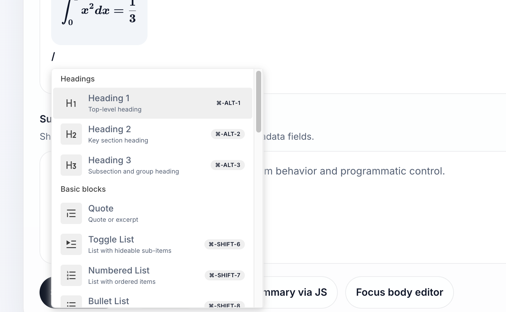

# @opositatest/markdown-text-editor

[](https://github.com/opositatest/opo-markdown-input/actions/workflows/lint.yml)
[](https://github.com/opositatest/opo-markdown-input/actions/workflows/typecheck.yml)
[](https://www.npmjs.com/package/@opositatest/markdown-text-editor)
[](https://www.jsdelivr.com/package/npm/@opositatest/markdown-text-editor)
[](https://www.typescriptlang.org/)
[](https://developer.mozilla.org/en-US/docs/Web/JavaScript/Guide/Modules)
[](https://developer.mozilla.org/en-US/docs/Web/API/Web_components)
[](https://react.dev/)

Rich-text editor that serializes content as Markdown. Ships as a self-contained Web Component and as a React component.

## Demo

<p align="center">
  
</p>

## Supported content

The editor currently focuses on text-first rich content that serializes cleanly to Markdown.

- Paragraphs
- Headings (`H1`, `H2`, `H3`)
- Bullet lists
- Numbered lists
- Checklists
- Toggle lists
- Block quotes
- Code blocks
- Links
- Inline styles: bold, italic, underline, strikethrough, and inline code
- Display math blocks written in LaTeX

### Math / LaTeX blocks

The package includes a custom math block on top of the default BlockNote schema. It renders display formulas with KaTeX and stores them as fenced display-math blocks in Markdown:

```md
$$
\int_0^1 x^2 dx = \frac{1}{3}
$$
```

In the editor UI, the math block is available from the slash menu and can be found with queries such as `/math`, `/latex`, `/katex`, or `/formula`.

### Scope note

This package documents and supports the text-oriented authoring experience above, including the custom math block. Advanced upstream BlockNote media and table flows are not currently part of the documented surface of this package.

## Web Component

Load via CDN (no build step required):

```html
<link
  rel="stylesheet"
  href="https://cdn.jsdelivr.net/npm/@opositatest/markdown-text-editor/dist/editor.css"
/>
<script
  type="module"
  src="https://cdn.jsdelivr.net/npm/@opositatest/markdown-text-editor/dist/editor.js"
></script>
```

### Usage

```html
<form>
  <markdown-text-editor
    name="body"
    value="Initial content"
    placeholder="Write here…"
    width="100%"
    height="320px"
    required
  ></markdown-text-editor>
</form>
```

### Attributes

| Attribute     | Type    | Description                            |
| ------------- | ------- | -------------------------------------- |
| `name`        | string  | Field name for form submission         |
| `value`       | string  | Initial Markdown value                 |
| `placeholder` | string  | Placeholder text shown when empty      |
| `width`       | string  | CSS width for the editor container     |
| `height`      | string  | CSS height for the editor container    |
| `disabled`    | boolean | Disables the editor                    |
| `readonly`    | boolean | Makes the editor read-only             |
| `required`    | boolean | Participates in native form validation |

`width` and `height` accept any valid CSS size, such as `320px`, `40rem`, or `100%`.

### Properties

| Property           | Type    | Description                 |
| ------------------ | ------- | --------------------------- |
| `element.value`    | string  | Get or set Markdown content |
| `element.width`    | string  | Get or set CSS width        |
| `element.height`   | string  | Get or set CSS height       |
| `element.disabled` | boolean | Get or set disabled state   |
| `element.readOnly` | boolean | Get or set read-only state  |

### Methods

| Method               | Description                         |
| -------------------- | ----------------------------------- |
| `focus()`            | Focus the editor                    |
| `getMarkdown()`      | Returns current content as Markdown |
| `setMarkdown(value)` | Replaces editor content             |

### Events

| Event    | Fires when                           |
| -------- | ------------------------------------ |
| `input`  | On every content change (keystroke)  |
| `change` | On blur if value changed since focus |
| `ready`  | Once the editor has initialized      |

### Form integration

`required` participates in native browser form validation via `ElementInternals` (with a hidden-input fallback for browsers that don't support it). The field value is submitted with the form using the `name` attribute.

---

## React Component

```bash
npm install @opositatest/markdown-text-editor
```

```tsx
import { MarkdownTextEditor } from "@opositatest/markdown-text-editor";
import "@opositatest/markdown-text-editor/style";

<MarkdownTextEditor defaultValue="Hello" width="100%" height="320px" />;
```

### Props

| Prop           | Type                                         | Description                                  |
| -------------- | -------------------------------------------- | -------------------------------------------- |
| `value`        | `string`                                     | Controlled Markdown value                    |
| `defaultValue` | `string`                                     | Uncontrolled initial value                   |
| `onChange`     | `(value: string) => void`                    | Called on every content change               |
| `onReady`      | `(handle: MarkdownTextEditorHandle) => void` | Called once editor has initialized           |
| `placeholder`  | `string`                                     | Placeholder text shown when empty            |
| `width`        | `string`                                     | CSS width for the editor container           |
| `height`       | `string`                                     | CSS height for the editor container          |
| `disabled`     | `boolean`                                    | Disables the editor                          |
| `readonly`     | `boolean`                                    | Makes the editor read-only                   |
| `className`    | `string`                                     | Additional CSS class on the editor container |

`width` and `height` accept any valid CSS size, such as `320px`, `40rem`, or `100%`.

### Imperative handle (via ref)

```tsx
import { useRef } from 'react'
import { MarkdownTextEditor, type TMarkdownTextEditorHandle } from '@opositatest/markdown-text-editor'

const ref = useRef<TMarkdownTextEditorHandle>(null)

<MarkdownTextEditor ref={ref} defaultValue="Hello" onChange={setValue} />
```

| Method               | Description                         |
| -------------------- | ----------------------------------- |
| `ref.focus()`        | Focus the editor                    |
| `ref.getMarkdown()`  | Returns current content as Markdown |
| `ref.setMarkdown(v)` | Replaces editor content             |

---

## Styling

The component does **not** use Shadow DOM, so all its elements are part of the regular DOM and can be targeted freely from the host page's CSS.

### CSS custom properties

These properties are defined on the `markdown-text-editor` element and can be overridden at any level:

| Property          | Default                    | Description                        |
| ----------------- | -------------------------- | ---------------------------------- |
| `--border-color`  | `rgba(15, 23, 42, 0.09)`   | Border of the editor field         |
| `--heading-color` | `#0f172a`                  | Text color inside the editor       |

```css
/* Override for all instances */
markdown-text-editor {
  --border-color: #d1d5db;
  --heading-color: #1f2937;
}

/* Override for a specific instance */
#my-editor {
  --border-color: #6366f1;
}
```

### Targeting component classes

Use these stable class names to override layout, size, fonts, or other visual properties:

| Selector                              | Description                         |
| ------------------------------------- | ----------------------------------- |
| `.markdown-text-editor__field`        | Editor container (border, radius, background) |
| `.markdown-text-editor__field .bn-editor` | Inner editing area (padding, min-height, font-size) |
| `.bn-container .bn-editor`            | BlockNote root (font-family, line-height) |

```css
/* Adjust editor size and typography */
.markdown-text-editor__field .bn-editor {
  min-height: 400px;
  font-size: 15px;
  line-height: 1.6;
}

/* Remove border radius */
.markdown-text-editor__field {
  border-radius: 0.25rem;
}
```

---

## Package exports

| Export                                    | Description                         |
| ----------------------------------------- | ----------------------------------- |
| `@opositatest/markdown-text-editor`       | React component + types             |
| `@opositatest/markdown-text-editor/input` | Self-contained Web Component bundle |
| `@opositatest/markdown-text-editor/style` | CSS stylesheet                      |

## Browser support

Requires browsers with support for [Custom Elements v1](https://caniuse.com/custom-elementsv1) and [ElementInternals](https://caniuse.com/mdn-api_elementinternals). All modern browsers (Chrome 77+, Firefox 98+, Safari 16.4+) are supported.

## Peer dependencies (React component only)

`react >= 19`, `react-dom >= 19`
